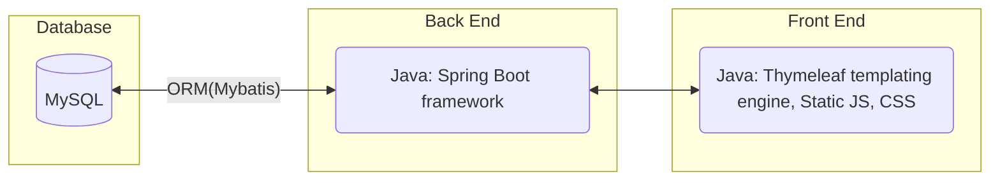
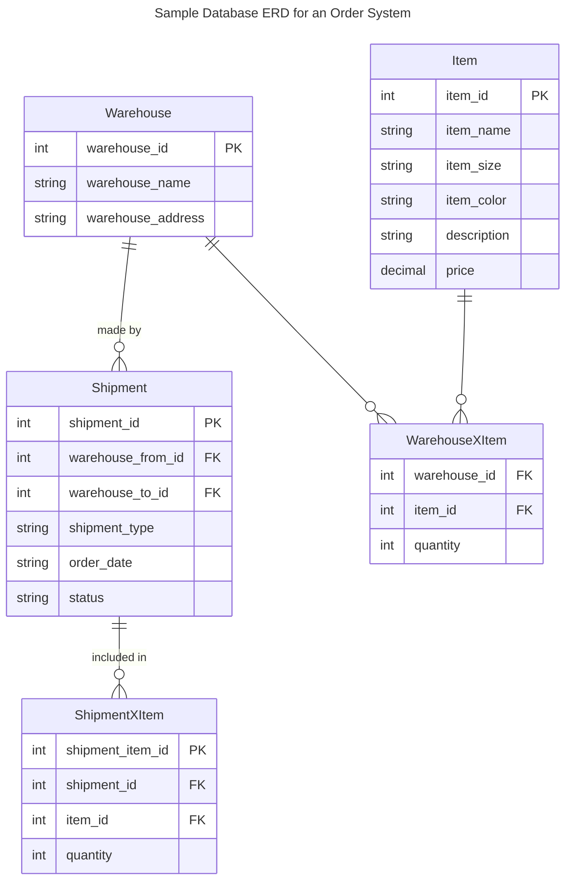
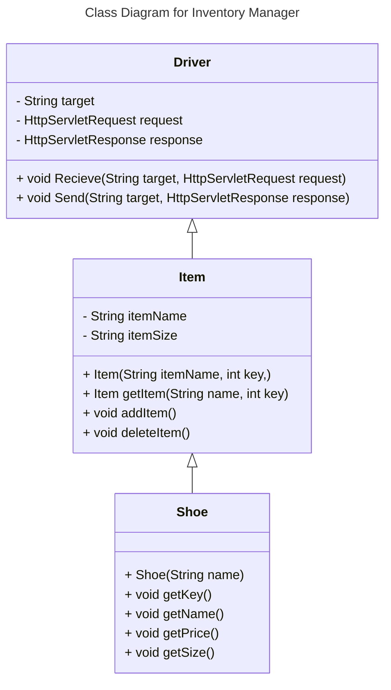
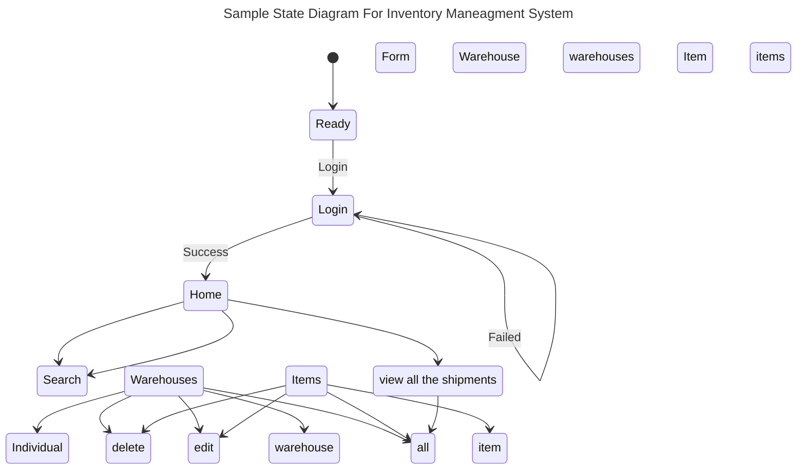
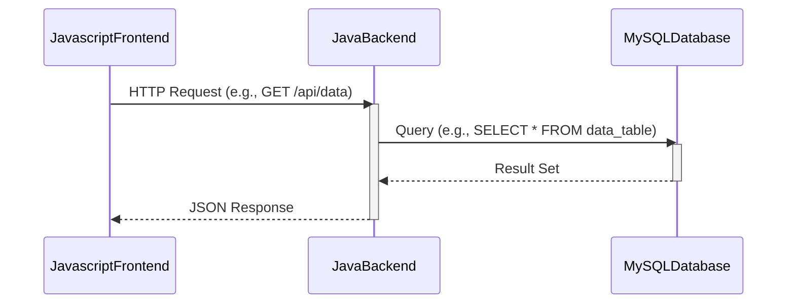

# Requirements and Specification Document

## StockSync Squad

<!--The name of your team.-->

### Project Abstract

<!--A one paragraph summary of what the software will do.-->

This is a full stack inventory management web application. The app allows a customer to store data on what inventory is available across a network of warehouses. The user can manage and edit that inventory, moving it between warehouses, as well as in or out of the network. Information about the products and the warehouses themselves are also accessible from the app. 

### Customer

This product is designed for merchants specifically in the shoe industry. It is intended for use for companies of any size. This product is specifically targeted for two user personas:

**Corporate manager**: this person doesn't necessarily spend their time at any of the facilities that actually have significant physical stuff. They may not be aware of the fine details of how the individual facilities operate. They are concerned with summary statistics aggregated across all facilities, or possibly seeing which facilities are above or below thresholds for some metric.

**Facility manager**: this person handles the details for a single facility. They know the ins and outs of their single facility, but basically nothing about other facilities. 

### User Requirements

<!--This section lists the behavior that the users see. This information needs to be presented in a logical, organized fashion. It is most helpful if this section is organized in outline form: a bullet list of major topics (e.g., one for each kind of user, or each major piece of system functionality) each with some number of subtopics.-->

- **Navigation:**
  - The application must provide a universal navigation bar present on all pages for quick access to Home,Item Information,Warehouse Information, and Shipment pages.
  - User identification when first logging on
- **Information Accessibility:**
  - An information page for the warehouse should show all data for that given warehouse including items with it.
  - Warehouse pages enable users to view present inventory data
- **Search Functionality:**
  - Users must be able to perform searches with multiple filters, accessing detailed pages for items,or warehouses from the result. An empty search should return all entries
  - Within the search results for warehouses, users should click a specific warehouse and access the information page for that entry
- **Data Management:**
  - Thes system must allow the creation, editing, movement, and deletion of inventory entries with appropriate validation and feedback mechanism
    - Entries with invalid information (missing fields or certain duplicates of unique fields) should fail with an error message
    - Users should edit the data of existing entries
    - Users should move items from one warehouse to another 
    - This should be done individually on the item level or in bulk on the warehouse level
    - Users can delete multiple entries
- **Performance Requirment**
    - Users should store at least 100 warehouses, 1,000 different users, and 10,000 products but limited to 500 for each in the testing phase
    - Users should be able to load any webpage in "average" time on an "average" network - 3.21 seconds on a 60 mbps connection. In other words, no page should exceed 200 MB

### User stories/requirements provided by the customer Daniel Semeda: ###

As a corporate manager, I want to see how many facilities I have.

As a corporate manager, I want to see the shipments from and to the warehouses

As a corporate manager, I want to create a new facility.

As a facility manager, I want to view what I have in my facility's inventory.

As a facility manager, I want to record a shipment that has arrived at or left the facility, including the quantities of items in that shipment, and I want this to automatically update my inventory.

As a facility manager, I want to see a list of shipments that contained a particular kind of item.

### Use Cases & User Stories

<!--Use cases and user stories that support the user requirements in the previous section. The use cases should be based off user stories. Every major scenario should be represented by a use case, and every use case should say something not already illustrated by the other use cases. Diagrams (such as sequence charts) are encouraged. Ask the customer what are the most important use cases to implement by the deadline. You can have a total ordering, or mark use cases with “must have,” “useful,” or “optional.” For each use case you may list one or more concrete acceptance tests (concrete scenarios that the customer will try to see if the use case is implemented).-->

> As a user, I can record shipments that occur between shipments or in and out of the network

> As a user, when I search for a given item, I should see total quantity, as well as a breakdown of where those quantities are

> As a user, when I'm looking at a warehouse I shall see what is at that warehouse

### Item specification for Shoe

##### ID (Primary Key): A unique identifier for each shoe entry.
* Datatype: INT or BIGINT
* Properties: Auto-increment, Not Null, Primary Key
* Description: an integer that uniquely identifies each record. It should auto-increment

##### Name: The name of the shoe.
* Datatype: VARCHAR
* Length: Up to 255 for VARCHAR
* Properties: Not Null
* Description: A string that holds the name of the shoe. 

##### Size:  The size of the shoe
* Datatype: DECIMAL
* Properties: Not Null 
* Description: standard numerical sizes,

##### Price: The price of the shoe
* Datatype: FLOAT
* Properties: Not Null 
* Description: Up to two decimal places

### Shipment Requirements
#### Core Functionalities
* **Recording Arrived or Departed Shipments**:
    * The system should allow the facility manager to record details of shipments arriving at or leaving the facility.
        * Each shipment record should include: 
            * List of items
            * Quantities of each item
    * The inventory should automatically update based on these records, increasing or decreasing item quantities.
* **Tracking Shipments by Item**:
    * The system should allow querying the history of shipments 
    * The query should return a list of shipments, including dates, and quantities of the item.

### Action Table Requirements

* **Log Details of Incoming Shipments (ACT01)**
    * Responsible Role: Facility Manager
    * Expected Outcome: All details of incoming shipments are recorded, and the inventory is updated accordingly.
    * 
* **Log Details of Outgoing Shipments (ACT02)**
    * Responsible Role: Facility Manager
    * Expected Outcome: All details of outgoing shipments are recorded, and the inventory is adjusted to reflect these changes.

* **List Shipments Containing a Specific Item (ACT04)**
    * Responsible Role: Facility Manager/User
    * Expected Outcome: Users can list all shipments (past and scheduled) containing a specific item.

* **Record Processes Affecting Inventory (ACT05)**
    * Responsible Role: Facility Manager
    * Expected Outcome: All processes that affect inventory (inputs, outputs) are recorded

* **Search and Display Item Inventory Details (ACT07)**
    * Responsible Role: User
    * Expected Outcome: Users should access detailed information on item inventory, including location and quantity.

* **View Historical Inventory Status of a Warehouse (ACT08)**
    * Responsible Role: User
    * Expected Outcome: Users should view the inventory status of any warehouse 
* **Manually Update Inventory Levels (ACT10)**
    * Responsible Role: Facility Manager/User
    * Expected Outcome: Users have the ability to manually adjust inventory levels

<!--### User Interface Requirements-->

<!--Describes any customer user interface requirements including graphical user interface requirements as well as data exchange format requirements. This also should include necessary reporting and other forms of human readable input and output. This should focus on how the feature or product and user interact to create the desired workflow. Describing your intended interface as “easy” or “intuitive” will get you nowhere unless it is accompanied by details.-->

<!--NOTE: Please include illustrations or screenshots of what your user interface would look like -- even if they’re rough -- and interleave it with your description.-->

<!--Images can be included with ``-->

<!--### System Requirements-->

<!--List here all of the external entities, other than users, on which your system will depend. For example, if your system inter-operates with sendmail, or if you will depend on Apache for the web server, or if you must target both Unix and Windows, list those requirements here. List also memory requirements, performance/speed requirements, data capacity requirements, if applicable.-->

### Specification

<!--A detailed specification of the system. UML, or other diagrams, such as finite automata, or other appropriate specification formalisms, are encouraged over natural language.-->

<!--Include sections, for example, illustrating the database architecture (with, for example, an ERD).-->

<!--Included below are some sample diagrams, including some example tech stack diagrams.-->

#### Technology Stack

#### Database

#### Class Diagram

#### Flowchart

#### Behavior

#### Sequence Diagram

### Standards & Conventions

# Coding Standards

## 1. Naming Conventions
- **Local Variables**: Use camel case (e.g., `localData`).
- **Global Variables**: Start with a capital letter (e.g., `GlobalData`).
- **Constants**: Use all capital letters (e.g., `PI`).
- **Functions**: Use camel case (e.g., `getShipmentDate`).

## 2. Indentation
- Use spaces after commas between function arguments.
- Indent nested blocks properly.
- Start all braces on a new line.

## 3. General Coding Guidelines
- Avoid complex coding styles.
- Use meaningful names for identifiers.
- Document the code properly with comments.
- Keep functions short and focused.
- Avoid using GOTO statements.

## Advantages of Coding Guidelines
- Increase software efficiency and reduce development time.
- Help in early error detection to reduce costs.
- Improve code readability and maintainability.
- Reduce the hidden costs of software development.

For more detailed information on coding standards and guidelines, refer to [GeeksforGeeks](https://www.geeksforgeeks.org/coding-standards-and-guidelines/).

