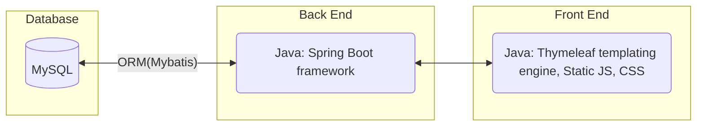
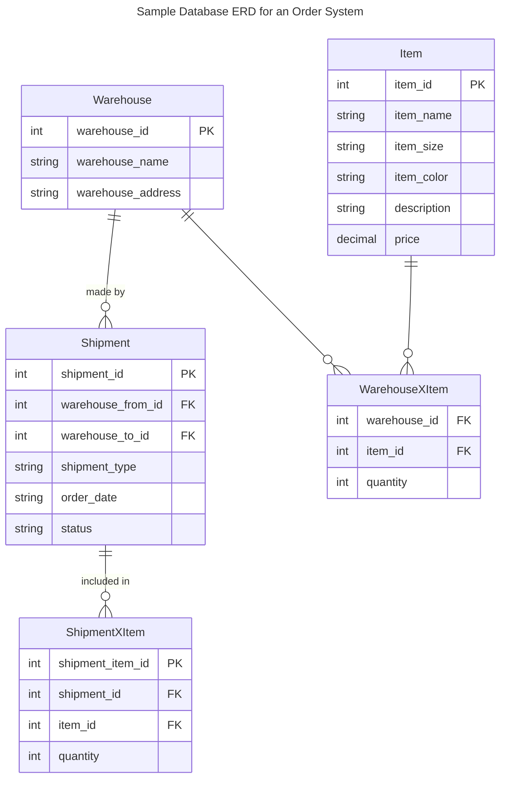
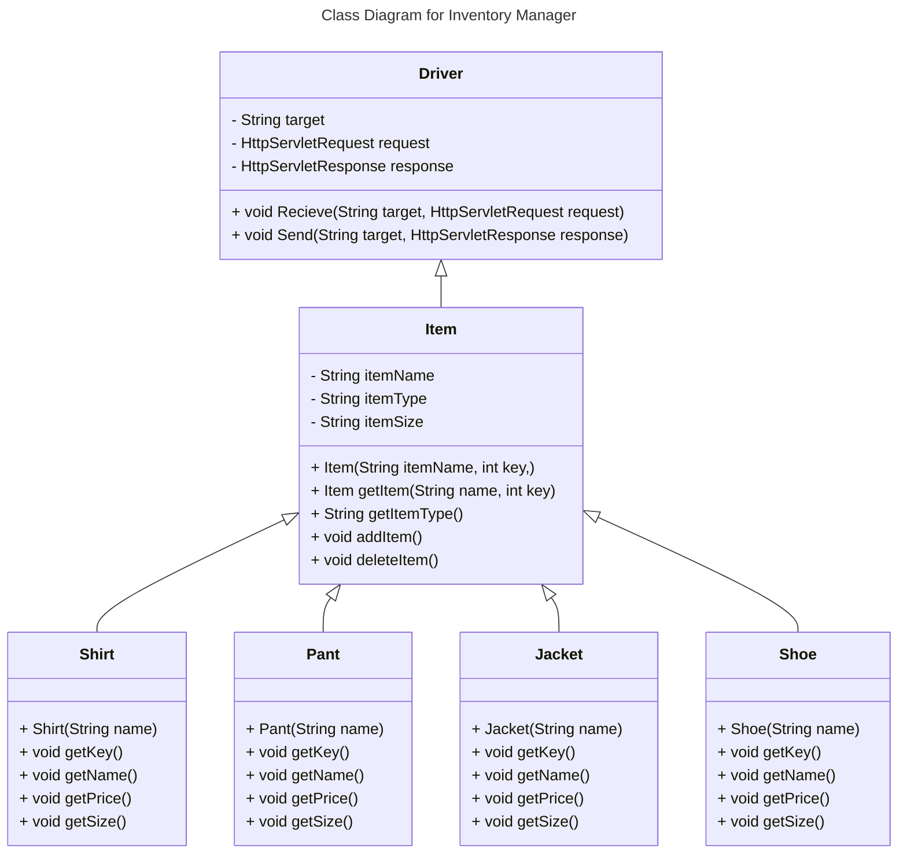
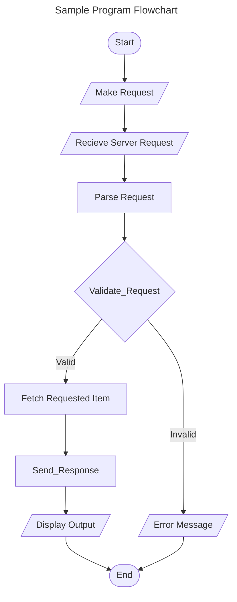
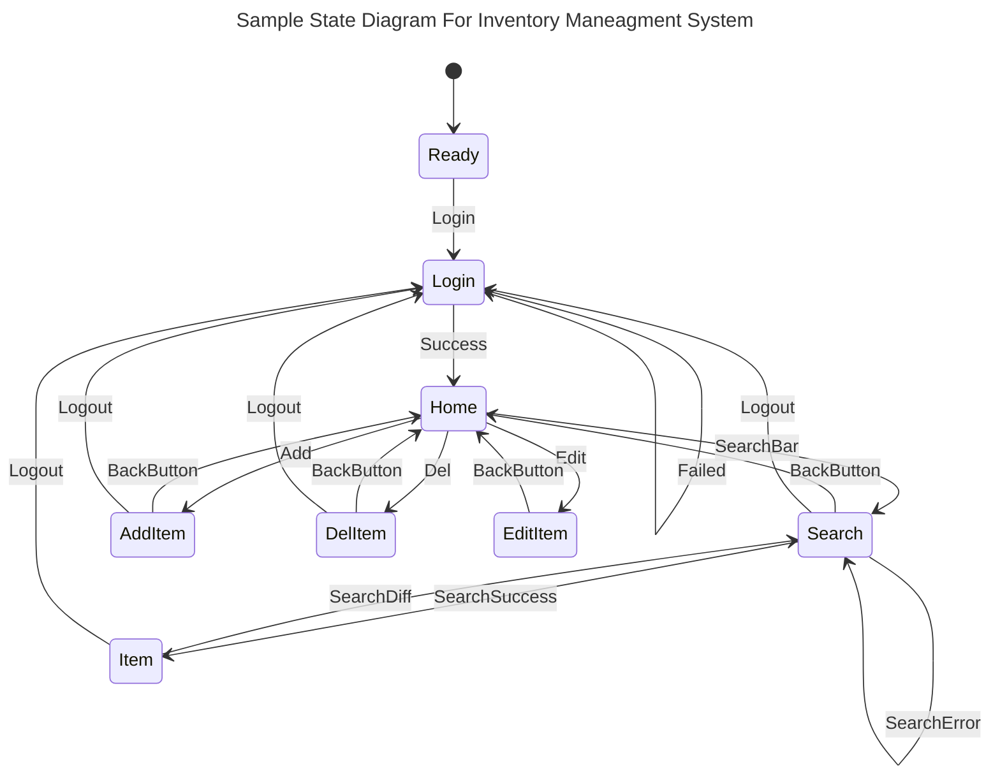
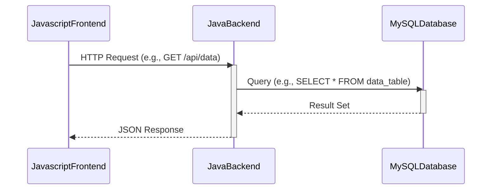

# Requirements and Specification Document

## StockSync Squad

<!--The name of your team.-->

### Project Abstract

<!--A one paragraph summary of what the software will do.-->

This is a full stack inventory management web application. The app allows a customer to store data on what inventory is available across a network of warehouses. The user can manage and edit that inventory, moving it between warehouses, as well as in or out of the network. Information about the products and the warehouses themselves are also accessible from the app. The app also stores a full log of actions taken by users so there is a clear audit trail for every piece of inventory in the network.

### Customer

This product is designed for merchants specifically in the shoe industry. It is intended for use for companies of any size. This product is specifically targeted for two user personas:

Corporate manager: this person doesn't necessarily spend their time at any of the facilities that actually have significant physical stuff. They may not be aware of the fine details of how the individual facilities operate. They are concerned with summary statistics aggregated across all facilities, or possibly seeing which facilities are above or below thresholds for some metric.

Facility manager: this person handles the details for a single facility. They know the ins and outs of their single facility, but basically nothing about other facilities. 

### User Requirements

<!--This section lists the behavior that the users see. This information needs to be presented in a logical, organized fashion. It is most helpful if this section is organized in outline form: a bullet list of major topics (e.g., one for each kind of user, or each major piece of system functionality) each with some number of subtopics.-->

- Users can navigate around the application easily 
  - A universal nav bar allows users to navigate to the primary pages from any given page
    - Home page
    - Log page
  - Search results link to a page for every result's individual information page
    - Item page with information about a given item
    - Warehouse page with information about a given warehouse
  - Users can see what their login/username is from any page in the web application
    - Users can log out from anywhere in the application
- Users can view the information pages for a given item or warehouse
  - An information page for a given item or warehouse should show a log of all actions performed by all users on that item or warehouse
  - An information page for a given item or warehouse should show all data for that given item or warehouse
  - From a warehouse information page, the user should be able to see the inventory of the warehouse from any given day in the past or present
- Users can search for items based on any filter or set of filters
  - A search can filter only one data field or combine any number of data fields. An empty search should return all entries
  - Within the search results, users can click on an item or warehouse and access the information page for that entry
- Users can perform key actions
  - Users can create new entries (items or warehouses)
    - Entries with invalid information (mising fields or certain duplicates of unique fields) should fail with an error message
  - Users can edit the data of existing entries through
  - Users can move items from one warehouse to another or out of the inventory in case of a sale
    - This can be done individually on the item level or in bulk on the warehouse level
  - Users can delete existing entries entirely
- Users can see a log of actions taken by all users on a given item, at a given warehouse, or across the network
  - Actions can also be filtered by user(s), time, action type, or a combination of the above
- Users can store at least 100 warehouses, 1,000 different users, and 10,000 products
- Users should be able to load any webpage in "average" time on an "average" network - 3.21 seconds on a 60 mbps connection. In other words, no page should exceed 200 MB

User stories/requirements provided by the customer Daniel Semeda:

As a corporate manager, I want to see a count of how many facilities I have.

As a corporate manager, I want to see an aggregate of the inventory that has come in to and gone out from all facilities over an arbitrary time span.

As a corporate manager, I want to create a new facility.

As a corporate manager, I want to mark that a facility has ceased operation as of some date. I don't want that facility included in aggregates after that date.

As a corporate manager, I want to see my facilities represented on a map.

As a facility manager, I want to view what I have in my facility's inventory.

As a facility manager, I want to view what I used to have in my facility's inventory at some time in the past, and what I will have in my inventory at some point in the future.

As a facility manager, I want to record a shipment that has arrived at or left the facility, including the quantities of items in that shipment, and I want this to automatically update my inventory.

As a facility manager, I want to record a scheduled shipment (a shipment whose date and/or time is in the future).

As a facility manager, I want to see a list of shipments that contained a particular kind of item.

As a facility manager, I want to create a process that takes some set of inputs (inventory items and perhaps other inputs like time, money, and/or energy) and produces some set of outputs (which might include waste items).

### Use Cases & User Stories

<!--Use cases and user stories that support the user requirements in the previous section. The use cases should be based off user stories. Every major scenario should be represented by a use case, and every use case should say something not already illustrated by the other use cases. Diagrams (such as sequence charts) are encouraged. Ask the customer what are the most important use cases to implement by the deadline. You can have a total ordering, or mark use cases with “must have,” “useful,” or “optional.” For each use case you may list one or more concrete acceptance tests (concrete scenarios that the customer will try to see if the use case is implemented).-->

> As a user, I can record shipments that occur between shipments or in and out of the network

> As a user, when I search for a given item, I can see total quantity, as well as a breakdown of where those quantities are

> As a user, when I'm looking at a warehouse I can see what was at that warehouse at the start of any day in the past or present

> As a user, I can see an audit trail of updates all other users have made to the data

<!--### User Interface Requirements-->

<!--Describes any customer user interface requirements including graphical user interface requirements as well as data exchange format requirements. This also should include necessary reporting and other forms of human readable input and output. This should focus on how the feature or product and user interact to create the desired workflow. Describing your intended interface as “easy” or “intuitive” will get you nowhere unless it is accompanied by details.-->

<!--NOTE: Please include illustrations or screenshots of what your user interface would look like -- even if they’re rough -- and interleave it with your description.-->

<!--Images can be included with ``-->
# Security Requirements for StockSync Inventory Management System

## 1. Authentication and Authorization
SR1.1: The system must implement secure authentication mechanisms for all users, requiring a username and a strong password. Security will be managed by tools explored in class (OAuth).
## 2. Data Encryption
SR2.1: All sensitive data, including personal user information, must be encrypted at rest using industry-standard encryption algorithms.
## 4. Audit Logging and Monitoring
SR4.1: All user actions and system changes must be logged with sufficient detail, including timestamps, user identifiers, and the nature of the action. Logs must be stored securely and reviewed regularly for suspicious activity.
## 5. Privacy Compliance
SR5.1: Ensure the system complies with applicable data protection and privacy laws, such as GDPR or CCPA, including mechanisms for data access requests, data correction, and data deletion by users.
## 6. Session Management
SR6.1: Securely manage user sessions, implementing timeout policies and protecting session tokens against hijacking. Use secure, HTTPOnly cookies for session management.
## 7. Secure Development Practices
SR7.1: Adhere to secure coding practices and guidelines throughout the development process. Conduct code reviews with a security focus to identify and fix security flaws.

<!--### Security Requirements-->

<!--Discuss what security requirements are necessary and why. Are there privacy or confidentiality issues? Is your system vulnerable to denial-of-service attacks?-->

<!--### System Requirements-->

<!--List here all of the external entities, other than users, on which your system will depend. For example, if your system inter-operates with sendmail, or if you will depend on Apache for the web server, or if you must target both Unix and Windows, list those requirements here. List also memory requirements, performance/speed requirements, data capacity requirements, if applicable.-->

### Specification

<!--A detailed specification of the system. UML, or other diagrams, such as finite automata, or other appropriate specification formalisms, are encouraged over natural language.-->

<!--Include sections, for example, illustrating the database architecture (with, for example, an ERD).-->

<!--Included below are some sample diagrams, including some example tech stack diagrams.-->

Item specificationShoe

##### ID (Primary Key): A unique identifier for each shoe entry.
* Datatype: INT or BIGINT
* Properties: Auto-increment, Not Null, Primary Key
* Description: an integer that uniquely identifies each record. It should auto-increment

##### Name: The name of the shoe.
* Datatype: VARCHAR
* Length: Up to 255 for VARCHAR
* Properties: Not Null
* Description: A string that holds the name of the shoe. 

##### Size:  The size of the shoe
* Datatype: DECIMAL
* Properties: Not Null 
* Description: standard numerical sizes,

##### Price: The price of the shoe
* Datatype: FLOAT
* Properties: Not Null 
* Description: Up to two decimal places

#### Technology Stack

#### Database

#### Class Diagram

#### Flowchart

#### Behavior

#### Sequence Diagram

### Standards & Conventions

# Coding Standards

## 1. Limited Use of Globals
- Define which types of data can be declared globally and which cannot.

## 2. Standard Headers for Different Modules
- **Name of the module**
- **Date of module creation**
- **Author of the module**
- **Modification history**
- **Synopsis**
- **Functions supported**: List with input and output parameters.
- **Global variables**: Accessed or modified by the module.

## 3. Naming Conventions
- **Local Variables**: Use camel case (e.g., `localData`).
- **Global Variables**: Start with a capital letter (e.g., `GlobalData`).
- **Constants**: Use all capital letters (e.g., `CONSDATA`).
- **Functions**: Use camel case starting with a small letter.

## 4. Indentation
- Use spaces after commas between function arguments.
- Indent nested blocks properly.
- Start all braces on a new line.

## 5. Error Return Values and Exception Handling Conventions
- Functions should return 0 or 1 to indicate failure or success.

## 6. General Coding Guidelines
- Avoid complex coding styles.
- Use meaningful names for identifiers.
- Document the code properly with comments.
- Keep functions short and focused.
- Avoid using GOTO statements.

## Advantages of Coding Guidelines
- Increase software efficiency and reduce development time.
- Help in early error detection to reduce costs.
- Improve code readability and maintainability.
- Reduce the hidden costs of software development.

For more detailed information on coding standards and guidelines, refer to [GeeksforGeeks](https://www.geeksforgeeks.org/coding-standards-and-guidelines/).

