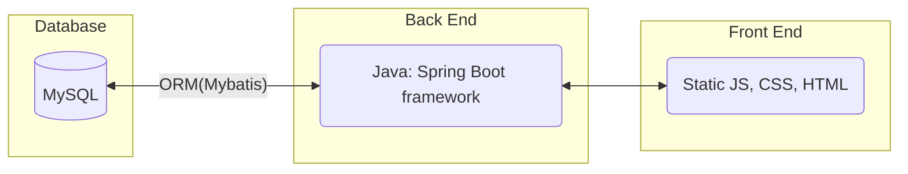
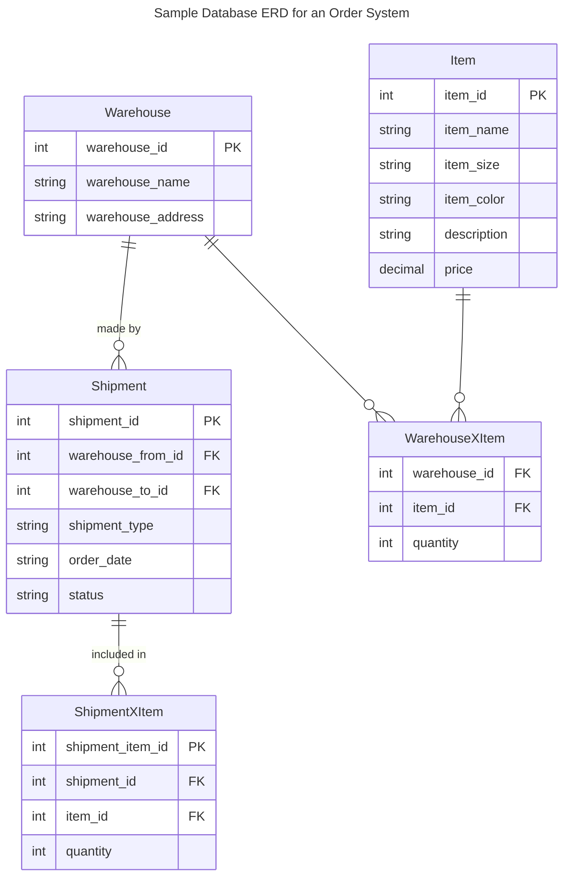
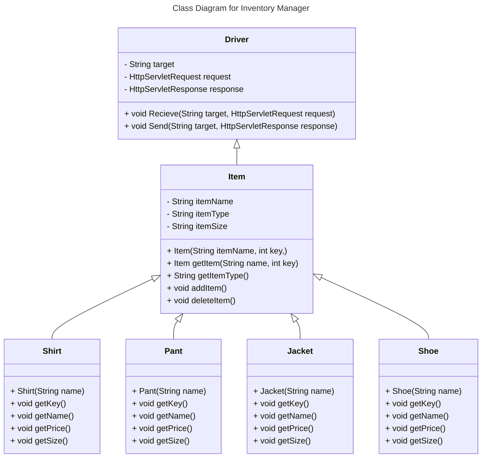
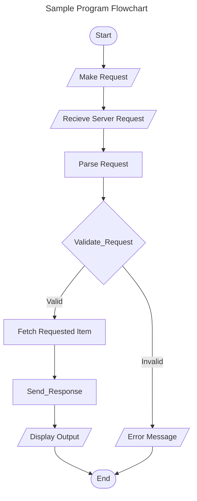
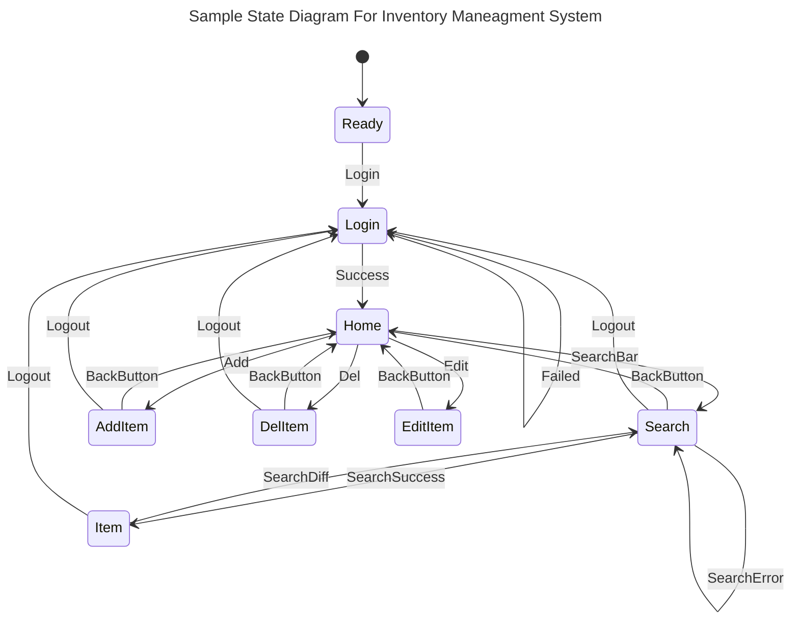
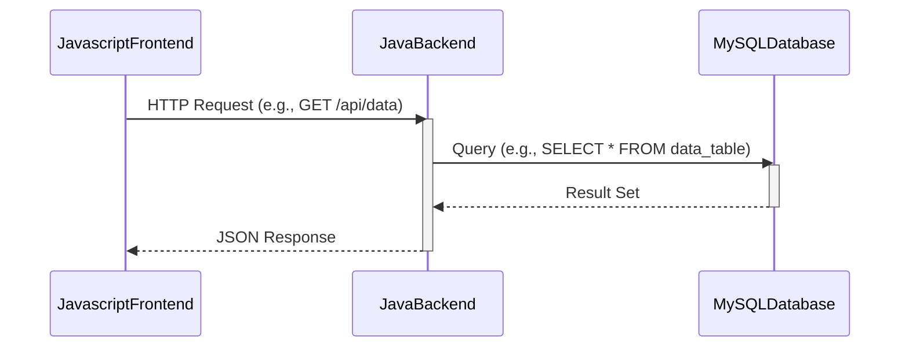

# Requirements and Specification Document

## TeamName

<!--The name of your team.-->

### Project Abstract

<!--A one paragraph summary of what the software will do.-->

This is an example paragraph written in markdown. You can use *italics*, **bold**, and other formatting options. You can also <u>use inline html</u> to format your text. The example sections included in this document are not necessarily all the sections you will want, and it is possible that you won't use all the one's provided. It is your responsibility to create a document that adequately conveys all the information about your project specifications and requirements.

Please view this file's source to see `<!--comments-->` with guidance on how you might use the different sections of this document. 

### Customer

<!--A brief description of the customer for this software, both in general (the population who might eventually use such a system) and specifically for this document (the customer(s) who informed this document). Every project will have a customer from the CS506 instructional staff. Requirements should not be derived simply from discussion among team members. Ideally your customer should not only talk to you about requirements but also be excited later in the semester to use the system.-->

### User Requirements

<!--This section lists the behavior that the users see. This information needs to be presented in a logical, organized fashion. It is most helpful if this section is organized in outline form: a bullet list of major topics (e.g., one for each kind of user, or each major piece of system functionality) each with some number of subtopics.-->

- Users can navigate around the application easily 
  - A universal nav bar allows users to navigate to the primary pages from any given page
    - Home page
    - Log page
  - Search results link to a page for every result's individual information page
    - Item page with information about a given item
    - Warehouse page with information about a given warehouse
  - Users can see what their login/username is from any page in the web application
    - Users can log out from anywhere in the application
- Users can view the information pages for a given item or warehouse
  - An information page for a given item or warehouse should show a log of all actions performed by all users on that item or warehouse
  - An information page for a given item or warehouse should show all data for that given item or warehouse
  - From a warehouse information page, the user should be able to see the inventory of the warehouse from any given day in the past or present
- Users can search for items based on any filter or set of filters
  - A search can filter only one data field or combine any number of data fields. An empty search should return all entries
  - Within the search results, users can click on an item or warehouse and access the information page for that entry
- Users can perform key actions
  - Users can create new entries (items or warehouses)
    - Entries with invalid information (mising fields or certain duplicates of unique fields) should fail with an error message
  - Users can edit the data of existing entries through
  - Users can move items from one warehouse to another or out of the inventory in case of a sale
    - This can be done individually on the item level or in bulk on the warehouse level
  - Users can delete existing entries entirely
- Users can see a log of actions taken by all users on a given item, at a given warehouse, or across the network
  - Actions can also be filtered by user(s), time, action type, or a combination of the above
- Users can store at least 100 warehouses, 1,000 different users, and 10,000 products
- Users should be able to load any webpage in "average" time on an "average" network - 3.21 seconds on a 60 mbps connection. In other words, no page should exceed 200 MB

### Use Cases & User Stories

<!--Use cases and user stories that support the user requirements in the previous section. The use cases should be based off user stories. Every major scenario should be represented by a use case, and every use case should say something not already illustrated by the other use cases. Diagrams (such as sequence charts) are encouraged. Ask the customer what are the most important use cases to implement by the deadline. You can have a total ordering, or mark use cases with “must have,” “useful,” or “optional.” For each use case you may list one or more concrete acceptance tests (concrete scenarios that the customer will try to see if the use case is implemented).-->

> As a user, I can record shipments that occur between shipments or in and out of the network

> As a user, when I search for a given item, I can see total quantity, as well as a breakdown of where those quantities are

> As a user, when I'm looking at a warehouse I can see what was at that warehouse at the start of any day in the past or present

> As a user, I can see an audit trail of updates all other users have made to the data

### User Interface Requirements

<!--Describes any customer user interface requirements including graphical user interface requirements as well as data exchange format requirements. This also should include necessary reporting and other forms of human readable input and output. This should focus on how the feature or product and user interact to create the desired workflow. Describing your intended interface as “easy” or “intuitive” will get you nowhere unless it is accompanied by details.-->

<!--NOTE: Please include illustrations or screenshots of what your user interface would look like -- even if they’re rough -- and interleave it with your description.-->

Images can be included with ``

### Security Requirements

<!--Discuss what security requirements are necessary and why. Are there privacy or confidentiality issues? Is your system vulnerable to denial-of-service attacks?-->

### System Requirements

<!--List here all of the external entities, other than users, on which your system will depend. For example, if your system inter-operates with sendmail, or if you will depend on Apache for the web server, or if you must target both Unix and Windows, list those requirements here. List also memory requirements, performance/speed requirements, data capacity requirements, if applicable.-->

| You    |    can    |    also |
| ------ | :-------: | ------: |
| change |    how    | columns |
| are    | justified |         |

### Specification

<!--A detailed specification of the system. UML, or other diagrams, such as finite automata, or other appropriate specification formalisms, are encouraged over natural language.-->

<!--Include sections, for example, illustrating the database architecture (with, for example, an ERD).-->

<!--Included below are some sample diagrams, including some example tech stack diagrams.-->

You can make headings at different levels by writing `# Heading` with the number of `#` corresponding to the heading level (e.g. `## h2`).

#### Technology Stack

Here are some sample technology stacks that you can use for inspiration:

#### Database

#### Class Diagram

#### Flowchart

#### Behavior

#### Sequence Diagram

### Standards & Conventions

# Coding Standards

## 1. Limited Use of Globals
- Define which types of data can be declared globally and which cannot.

## 2. Standard Headers for Different Modules
- **Name of the module**
- **Date of module creation**
- **Author of the module**
- **Modification history**
- **Synopsis**
- **Functions supported**: List with input and output parameters.
- **Global variables**: Accessed or modified by the module.

## 3. Naming Conventions
- **Local Variables**: Use camel case (e.g., `localData`).
- **Global Variables**: Start with a capital letter (e.g., `GlobalData`).
- **Constants**: Use all capital letters (e.g., `CONSDATA`).
- **Functions**: Use camel case starting with a small letter.

## 4. Indentation
- Use spaces after commas between function arguments.
- Indent nested blocks properly.
- Start all braces on a new line.

## 5. Error Return Values and Exception Handling Conventions
- Functions should return 0 or 1 to indicate failure or success.

## 6. General Coding Guidelines
- Avoid complex coding styles.
- Use meaningful names for identifiers.
- Document the code properly with comments.
- Keep functions short and focused.
- Avoid using GOTO statements.

## Advantages of Coding Guidelines
- Increase software efficiency and reduce development time.
- Help in early error detection to reduce costs.
- Improve code readability and maintainability.
- Reduce the hidden costs of software development.

For more detailed information on coding standards and guidelines, refer to [GeeksforGeeks](https://www.geeksforgeeks.org/coding-standards-and-guidelines/).

